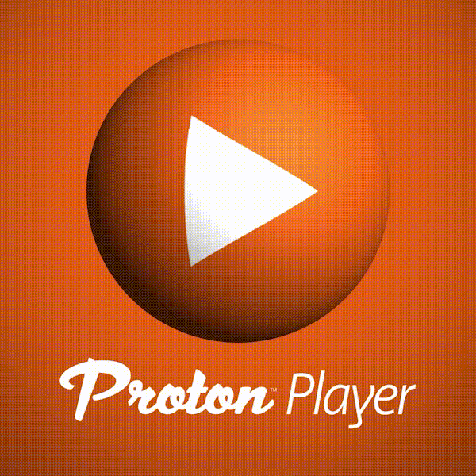

  

  

## tl;dr

- Proton Player is an HTML5-based streaming music player optimized for compatibility across many devices and browsers.
- The player is "headless", meaning that it doesn't come packaged with any visual components. It is meant to serve as a toolkit for building your own music player, offering features such as seeking, pausing, and preloading upcoming audio files.
- We use it to power our own React-based music player [over on Proton Radio](https://protonradio.com), so its stability and ongoing development is backed by a paid development team and our many happy customers. :)

## Why did we make this?

While the Web Audio and Mediasource APIs are both incredibly powerful tools for manipulating audio within a web browser, their specs have both grown far more quickly than browser maintainers can implement them. At the same time, device- and browser-specific implementation details and philosophical differences with respect to things such as autoplay make it impossible to "write once, run anywhere" when working with audio on the web. We needed a reliable way to support smooth MP3 streams across all modern devices and browsers without pulling our hair out.

## Installation

`npm install proton-player`

## Documentation

[API Documentation](DOCS.md)

## Acknowledgements

- [Rich-Harris/phonograph](https://github.com/Rich-Harris/phonograph) The initial version of Proton Player was adapted from this tool. Phonograph taught us a lot about how to handle the problems inherent in streaming audio on mobile devices.
